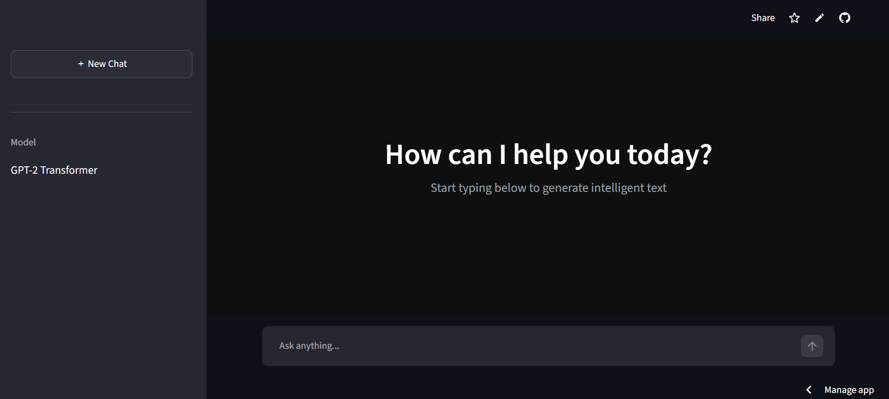
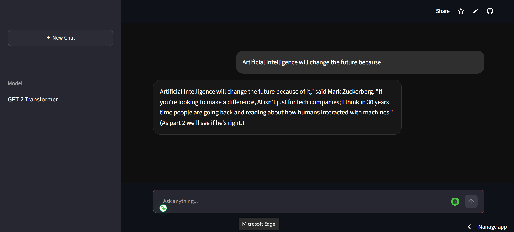

<div align="center">

# 🤖 AI Text Generator Using GPT-2 Transformer

### 🚀 Prodigy GenAI Internship — Task 01


<br>


</div>


---

# 📌 Overview

This project is developed as part of the **Prodigy GenAI Internship Task-01**.

The objective of this project is to build an AI-powered text generation system using the **GPT-2 Transformer model**.

The application takes a user-provided text prompt and generates coherent and contextually relevant continuation text using advanced Natural Language Processing techniques.


---

# 🌐 Live Application

🚀 Experience the project here:

🔗 https://appigyga01-awnzhunj4tadxxsu7qidpy.streamlit.app/


---

# 📸 Project Preview


## 🏠 Application Interface




<br>


## 🤖 AI Generated Result




---

# ✨ Features

✔️ GPT-2 Transformer based generation  
✔️ Interactive Streamlit web interface  
✔️ Real-time AI text generation  
✔️ Custom user prompts  
✔️ Adjustable output length  
✔️ Lightweight and easy deployment  
✔️ Cloud hosted application  


---

# 🧠 Model Information

### GPT-2 Transformer

GPT-2 is a transformer-based language model capable of:

- Understanding text patterns
- Predicting next words
- Generating human-like sentences
- Learning contextual relationships


Model Used:

```
GPT-2
```

Framework:

```
Hugging Face Transformers
```


---

# 🛠️ Tech Stack

| Technology | Usage |
|----------|----------|
| Python 🐍 | Programming Language |
| Streamlit 🎨 | Web Application |
| Hugging Face 🤗 | Transformer Pipeline |
| GPT-2 🧠 | Language Model |
| PyTorch 🔥 | Deep Learning Backend |
| GitHub 🚀 | Version Control |


---

# 📂 Project Structure

```bash
PRODIGY_GA_01

│
├── assets
│   └── images
│       ├── home.png
│       └── result.png
│
├── app.py
│
├── requirements.txt
│
└── README.md
```


---

# ⚙️ Installation & Setup


### 1️⃣ Clone Repository

```bash
git clone https://github.com/rmeghana375-lab/PRODIGY_GA_01.git
```


### 2️⃣ Open Project

```bash
cd PRODIGY_GA_01
```


### 3️⃣ Install Dependencies

```bash
pip install -r requirements.txt
```


### 4️⃣ Run Application

```bash
streamlit run app.py
```


---

# 📦 Requirements

```txt
streamlit
transformers
torch
```


---

# 🎯 Learning Outcomes

Through this project learned:

- Fundamentals of Generative AI
- Transformer architecture workflow
- GPT-2 text generation pipeline
- Hugging Face model integration
- Streamlit deployment process


---

# 🚀 Future Enhancements

🔹 Add multiple AI models  
🔹 Improve response accuracy  
🔹 Add chat history  
🔹 Support custom fine-tuned models  
🔹 Enhance UI/UX design  


---

<div align="center">

## ⭐ Prodigy GenAI Internship Task-01 Completed ⭐


### Made with ❤️ using Generative AI

</div>